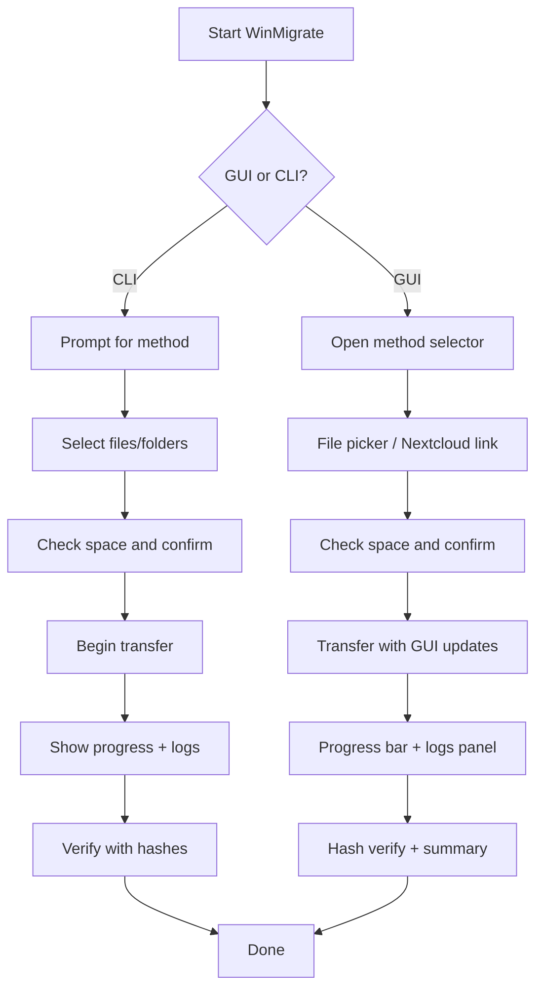

# WinMigrate – User Interaction Flow

This document describes the expected flow of user interaction in both CLI and GUI modes.

---

## 🖥️ CLI Mode Flow

1. **Startup:** User launches `winmigrate.exe` or `python main.py`
2. **Mode Detection:** CLI is used by default unless `--gui` is passed
3. **User Prompts:**
   - Select transfer method: USB / Network / Nextcloud
   - Select source/destination directory
   - Confirm file size estimate vs available space
4. **Transfer Begins:**
   - Progress is logged to screen and file
   - Hash verifier checks integrity
5. **Completion:**
   - Summary printed to CLI
   - Optional program report generated

---

## 🪟 GUI Mode Flow

1. **Launch:** User runs with `--gui` or separate GUI executable
2. **Initial Screen:**
   - Transfer method selection
3. **Setup Phase:**
   - File picker dialog
   - Nextcloud linking (if chosen)
4. **Transfer Execution:**
   - Progress bars update in real-time
   - Pause / resume / cancel available
5. **Post-Transfer:**
   - Hash verification summary
   - Viewable report of actions

---

## 🗺️ Visual Interaction Flow (Mermaid)

